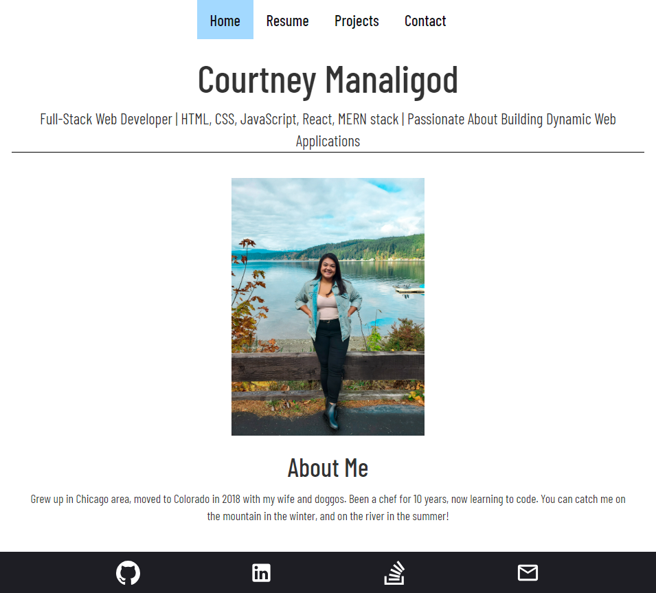
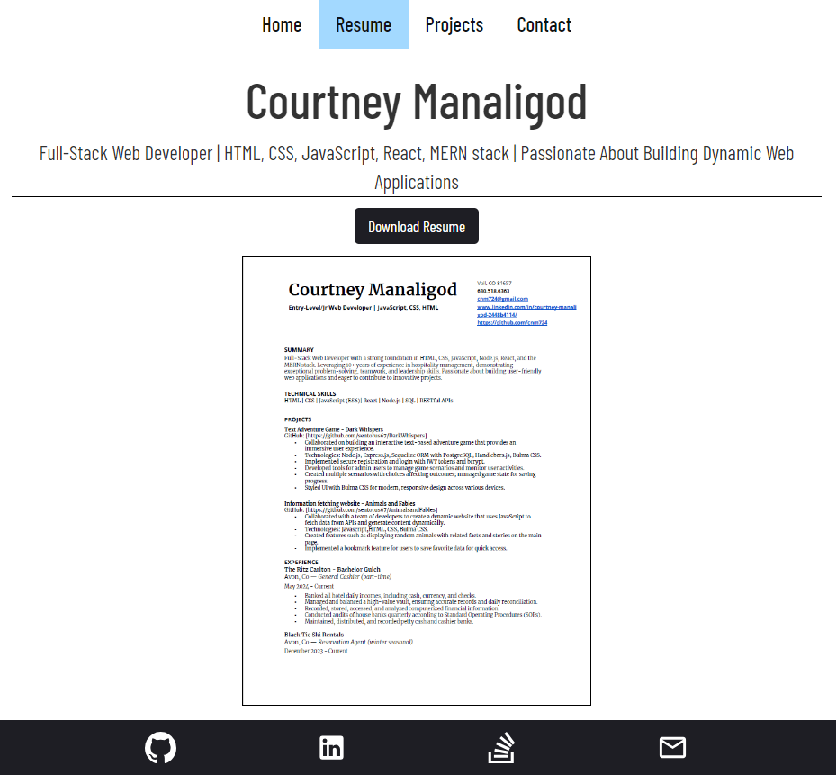
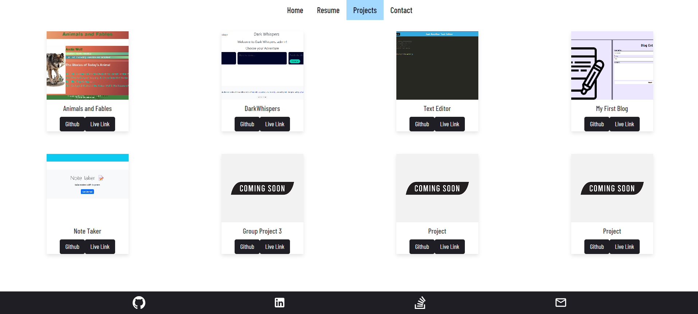
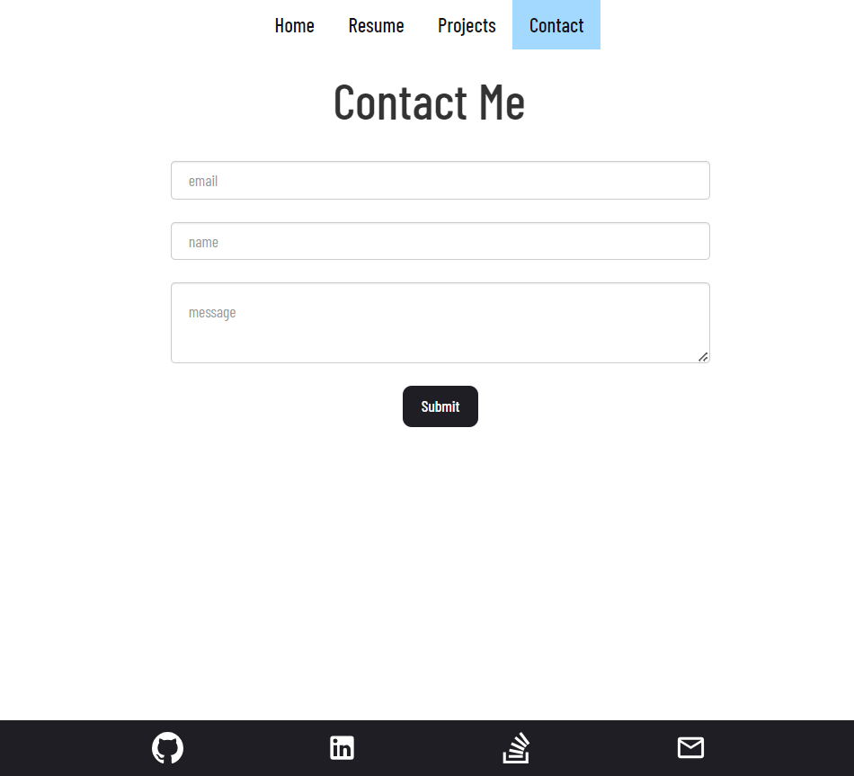

  
# React Portfolio

  
   
  
  
  
  
  

## Table of Contents

- [Description](#description)
- [Installation](#installation)
- [Usage](#usage)
- [Credits](#credits)
- [License](#license)

## Description

My React Profile project was built as a online presence to demonstrate my knowledge of full-stack coding. This application displays what I have learned thus far using react and vite. On the webpage you will find: a brief about me section, my experience, projects I have created, and a section to reach out to me.

## Installation

#### To install:
- fork or clone the repo

#### then in terminal:
- `npm i`
- `npm run build`
- `npm start`

## Usage

## Credits

- activity 23 for routes
- center bootstrap navbar title: https://stackoverflow.com/questions/43497560/center-bootstrap-navbar-title
- keeping the footer on the bottom: https://stackoverflow.com/questions/39857425/react-page-keep-footer-at-the-bottom-of-the-page
- svg socials icons: https://iconify.design/
_
## License

This project is covered by the MIT license.